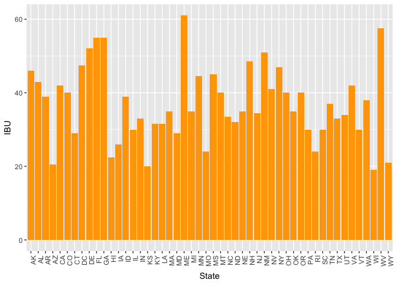

---
title: "USBeers"
author: "Chiranjeevi Mallavarapu"
date: "6/29/2017"
output: 
  html_document:
   keep_md: yes
----

# Project: US Beers and Breweries - An insight

----


# Project Introduction: 

This analysis to find out how the beers and breweries are distributed across the states and also overall relationship in terms of alcoholic content vs bitterness of the beers in USA. The data input comprises of two data sets beers.csv, breweries.csv. The specific questions are addressed one by one below.


* Goal: Create an RStudio/GitHub project for the analysis of the beer, breweries data sets so anyone can both reproduce the results and/or access published results. 

* Deliverable: Markdown file and all relevant files uploaded to GitHub


-----

## File Organization

* Repository Main folder: contains README.md, USBeers.Rmd,USBeers.md,USBeers.html files and sub folders of DataCleanup and DataAnalysis 

* DataCleanup folder:  Contains code for getting the data, sub folder 'Data' contains the data files
  
  Files:
  - /DataCleanup/GetData.R: loads data from below source data files 
  - /DataCleanup/Data/Beer.csv
  - /DataCleanup/Data/Breweries.csv
  
* DataAnalysis folder:  Contains statistical analysis code
  Files:
  - /DataAnalysis/PrepData.R: combines the two data sets provided and contains the code to answer the required questions on the dataset
  
Further descriptions about the data sets: 

Beers dataset contains a list of 2410 US craft beers and Breweries dataset contains 558 US breweries. 

The field descriptions are as below.

Beers.csv:

Name: Name of the beer,
Beer ID: Unique identifier of the beer,
ABV: Alcohol by volume of the beer,
IBU: International Bitterness Units of the beer,
Brewery ID: Brewery id associated with the beer,
Style: Style of the beer,
Ounces: Ounces of beer.

Breweries.csv:

Brew ID: Unique identifier of the brewery, Name: Name of the brewery,
City: City where the brewery is located, State: State where the brewery is located.


------

# First step is to get data from the csv files into R data sets


```r
knitr::opts_chunk$set(echo = TRUE, include = TRUE)

library(plyr)
library(ggplot2)

beers <-read.csv("DataLoad/Data/Beers.csv")
breweries <-read.csv("DataLoad/Data/Breweries.csv")
```

# 1. How many breweries are present in each state?


```r
knitr::opts_chunk$set(echo = TRUE, include = TRUE)
summary(breweries$State)
```

```
##  AK  AL  AR  AZ  CA  CO  CT  DC  DE  FL  GA  HI  IA  ID  IL  IN  KS  KY 
##   7   3   2  11  39  47   8   1   2  15   7   4   5   5  18  22   3   4 
##  LA  MA  MD  ME  MI  MN  MO  MS  MT  NC  ND  NE  NH  NJ  NM  NV  NY  OH 
##   5  23   7   9  32  12   9   2   9  19   1   5   3   3   4   2  16  15 
##  OK  OR  PA  RI  SC  SD  TN  TX  UT  VA  VT  WA  WI  WV  WY 
##   6  29  25   5   4   1   3  28   4  16  10  23  20   1   4
```

## Seems like Colorado has maximum number (47) of breweries

# 2. Merge beer data with breweries data by brewery id. Print first 6 observations and the last six observations to check the merged file. 


```r
knitr::opts_chunk$set(echo = TRUE, include = TRUE)
# Make sure to have the by column name same in both datasets
colnames(breweries)[1] <- "Brewery_id"
combined <- merge(beers,breweries,by="Brewery_id")
```


# First 6 observations of the merged dataset 


```r
knitr::opts_chunk$set(echo = TRUE, include = TRUE)
head(combined)
```

```
##   Brewery_id        Name.x Beer_ID   ABV IBU
## 1          1  Get Together    2692 0.045  50
## 2          1 Maggie's Leap    2691 0.049  26
## 3          1    Wall's End    2690 0.048  19
## 4          1       Pumpion    2689 0.060  38
## 5          1    Stronghold    2688 0.060  25
## 6          1   Parapet ESB    2687 0.056  47
##                                 Style Ounces             Name.y
## 1                        American IPA     16 NorthGate Brewing 
## 2                  Milk / Sweet Stout     16 NorthGate Brewing 
## 3                   English Brown Ale     16 NorthGate Brewing 
## 4                         Pumpkin Ale     16 NorthGate Brewing 
## 5                     American Porter     16 NorthGate Brewing 
## 6 Extra Special / Strong Bitter (ESB)     16 NorthGate Brewing 
##          City State
## 1 Minneapolis    MN
## 2 Minneapolis    MN
## 3 Minneapolis    MN
## 4 Minneapolis    MN
## 5 Minneapolis    MN
## 6 Minneapolis    MN
```

# Last 6 observations of the merged dataset


```r
knitr::opts_chunk$set(echo = TRUE, include = TRUE)
tail(combined)
```

```
##      Brewery_id                    Name.x Beer_ID   ABV IBU
## 2405        556             Pilsner Ukiah      98 0.055  NA
## 2406        557  Heinnieweisse Weissebier      52 0.049  NA
## 2407        557           Snapperhead IPA      51 0.068  NA
## 2408        557         Moo Thunder Stout      50 0.049  NA
## 2409        557         Porkslap Pale Ale      49 0.043  NA
## 2410        558 Urban Wilderness Pale Ale      30 0.049  NA
##                        Style Ounces                        Name.y
## 2405         German Pilsener     12         Ukiah Brewing Company
## 2406              Hefeweizen     12       Butternuts Beer and Ale
## 2407            American IPA     12       Butternuts Beer and Ale
## 2408      Milk / Sweet Stout     12       Butternuts Beer and Ale
## 2409 American Pale Ale (APA)     12       Butternuts Beer and Ale
## 2410        English Pale Ale     12 Sleeping Lady Brewing Company
##               City State
## 2405         Ukiah    CA
## 2406 Garrattsville    NY
## 2407 Garrattsville    NY
## 2408 Garrattsville    NY
## 2409 Garrattsville    NY
## 2410     Anchorage    AK
```

# 3. Report the number of NA’s in each column.


```r
knitr::opts_chunk$set(echo = TRUE, include = TRUE)
# We will use sapply and run function of is.na on all columns
sapply(combined, function(x) length(which(is.na(x))))
```

```
## Brewery_id     Name.x    Beer_ID        ABV        IBU      Style 
##          0          0          0         62       1005          0 
##     Ounces     Name.y       City      State 
##          0          0          0          0
```

## The IBU column has a total of 1005 NA's and ABV column has 62 NAs remaining all columns seems to be fully populated 

# 4. Compute the median alcohol content and international bitterness unit for each state. Plot a bar chart to compare.


```r
knitr::opts_chunk$set(echo = TRUE, include = TRUE)
 
MedABV_ST<-aggregate( ABV ~ State, data=combined, FUN=median)
MedABV_ST
```

```
##    State    ABV
## 1     AK 0.0560
## 2     AL 0.0600
## 3     AR 0.0520
## 4     AZ 0.0550
## 5     CA 0.0580
## 6     CO 0.0605
## 7     CT 0.0600
## 8     DC 0.0625
## 9     DE 0.0550
## 10    FL 0.0570
## 11    GA 0.0550
## 12    HI 0.0540
## 13    IA 0.0555
## 14    ID 0.0565
## 15    IL 0.0580
## 16    IN 0.0580
## 17    KS 0.0500
## 18    KY 0.0625
## 19    LA 0.0520
## 20    MA 0.0540
## 21    MD 0.0580
## 22    ME 0.0510
## 23    MI 0.0620
## 24    MN 0.0560
## 25    MO 0.0520
## 26    MS 0.0580
## 27    MT 0.0550
## 28    NC 0.0570
## 29    ND 0.0500
## 30    NE 0.0560
## 31    NH 0.0550
## 32    NJ 0.0460
## 33    NM 0.0620
## 34    NV 0.0600
## 35    NY 0.0550
## 36    OH 0.0580
## 37    OK 0.0600
## 38    OR 0.0560
## 39    PA 0.0570
## 40    RI 0.0550
## 41    SC 0.0550
## 42    SD 0.0600
## 43    TN 0.0570
## 44    TX 0.0550
## 45    UT 0.0400
## 46    VA 0.0565
## 47    VT 0.0550
## 48    WA 0.0555
## 49    WI 0.0520
## 50    WV 0.0620
## 51    WY 0.0500
```

```r
ABV_BC<-ggplot(na.omit(MedABV_ST), aes(x=State, y=ABV)) + geom_bar(stat="identity",fill="steelblue")+ theme(axis.text.x = element_text(angle=90, hjust=1))
ABV_BC
```

<!-- -->

## The bar chart above for median alcohol content by state indicates that most of the states are above 0.05 with Kentucky, Washington DC, Michigan, New Mexico and West Virginia above 0.06


```r
knitr::opts_chunk$set(echo = TRUE, include = TRUE)

MedIBU_ST<-aggregate( IBU ~ State, data=combined, FUN=median)
MedIBU_ST
```

```
##    State  IBU
## 1     AK 46.0
## 2     AL 43.0
## 3     AR 39.0
## 4     AZ 20.5
## 5     CA 42.0
## 6     CO 40.0
## 7     CT 29.0
## 8     DC 47.5
## 9     DE 52.0
## 10    FL 55.0
## 11    GA 55.0
## 12    HI 22.5
## 13    IA 26.0
## 14    ID 39.0
## 15    IL 30.0
## 16    IN 33.0
## 17    KS 20.0
## 18    KY 31.5
## 19    LA 31.5
## 20    MA 35.0
## 21    MD 29.0
## 22    ME 61.0
## 23    MI 35.0
## 24    MN 44.5
## 25    MO 24.0
## 26    MS 45.0
## 27    MT 40.0
## 28    NC 33.5
## 29    ND 32.0
## 30    NE 35.0
## 31    NH 48.5
## 32    NJ 34.5
## 33    NM 51.0
## 34    NV 41.0
## 35    NY 47.0
## 36    OH 40.0
## 37    OK 35.0
## 38    OR 40.0
## 39    PA 30.0
## 40    RI 24.0
## 41    SC 30.0
## 42    TN 37.0
## 43    TX 33.0
## 44    UT 34.0
## 45    VA 42.0
## 46    VT 30.0
## 47    WA 38.0
## 48    WI 19.0
## 49    WV 57.5
## 50    WY 21.0
```

```r
IBU_BC<-ggplot(na.omit(MedIBU_ST), aes(x=State, y=IBU)) + geom_bar(stat="identity") + theme(axis.text.x = element_text(angle=90, hjust=1))
IBU_BC
```

<!-- -->

## The bar chart above for median international bitterness unit by state indicates that Maine and West Virginia are the top 2 states having the highest median bitterness unit beers, with Floria and Georgia next in line


# 5.Which state has the maximum alcoholic beer? Which state has the most bitter beer?

## State that has maximum alcoholic beer

```r
knitr::opts_chunk$set(echo = TRUE, include = TRUE)
combined[which.max(combined$ABV), ]$State
```

```
## [1]  CO
## 51 Levels:  AK  AL  AR  AZ  CA  CO  CT  DC  DE  FL  GA  HI  IA  ID ...  WY
```

```r
combined[which.max(combined$ABV), ]$ABV
```

```
## [1] 0.128
```
## Colorado seems to be having the highest alcoholic beer with an ABV rating of 0.128

## State that has most bitter beer

```r
knitr::opts_chunk$set(echo = TRUE, include = TRUE)

combined[which.max(combined$IBU), ]$State
```

```
## [1]  OR
## 51 Levels:  AK  AL  AR  AZ  CA  CO  CT  DC  DE  FL  GA  HI  IA  ID ...  WY
```

```r
combined[which.max(combined$IBU), ]$IBU
```

```
## [1] 138
```
## Oregon seems to be having the highest bitter unit beer with an IBU of 138


# 6. Summary statistics for ABV (Alcohol by volume) variable.

```r
knitr::opts_chunk$set(echo = TRUE, include = TRUE)

summary(combined$ABV)
```

```
##    Min. 1st Qu.  Median    Mean 3rd Qu.    Max.    NA's 
## 0.00100 0.05000 0.05600 0.05977 0.06700 0.12800      62
```
## The alcohol content ABU seems to be varying from 0.001 to 0.128 with a median of 0.056 across all states the IQR (Q3-Q1) = 0.017

# 7. Is there a relationship between the bitterness of the beer and its alcoholic content? Draw a scatter plot.

```r
knitr::opts_chunk$set(echo = TRUE, include = TRUE, warning = FALSE)

ggplot(na.omit(combined), aes(x=ABV, y=IBU)) +geom_point(shape=1) + geom_smooth(method=lm)   
```

<!-- -->

```r
pr <- cor.test(combined$ABV, combined$IBU, method = "pearson")
pr
```

```
## 
## 	Pearson's product-moment correlation
## 
## data:  combined$ABV and combined$IBU
## t = 33.863, df = 1403, p-value < 2.2e-16
## alternative hypothesis: true correlation is not equal to 0
## 95 percent confidence interval:
##  0.6407982 0.6984238
## sample estimates:
##       cor 
## 0.6706215
```

## Based on the above plot there seems to be a slightly above average positive linear relationship between the bitterness of beer and its alcoholic content.The person's r value is 0.67.


# R Markdown

This is an R Markdown document. Markdown is a simple formatting syntax for authoring HTML, PDF, and MS Word documents. For more details on using R Markdown see <http://rmarkdown.rstudio.com>.
